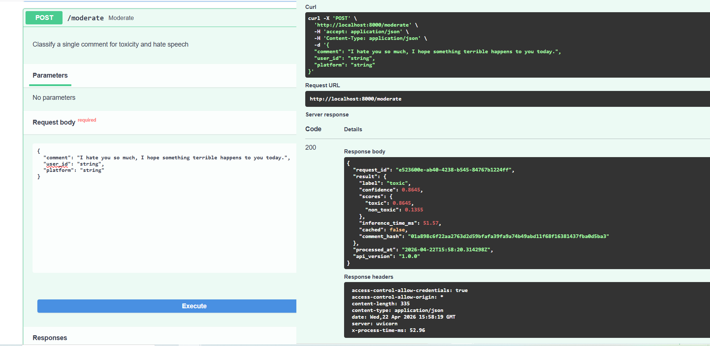
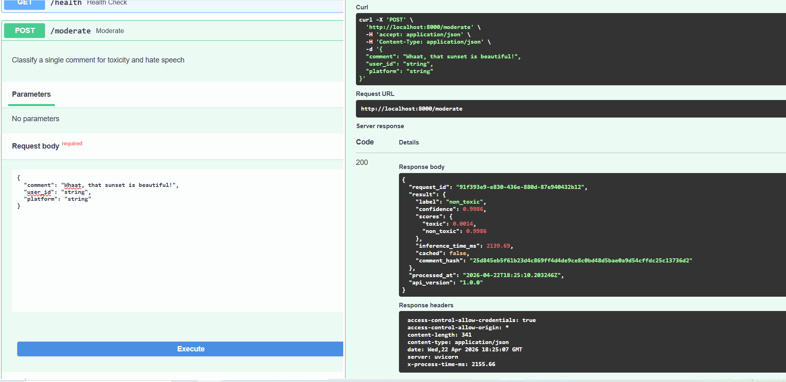
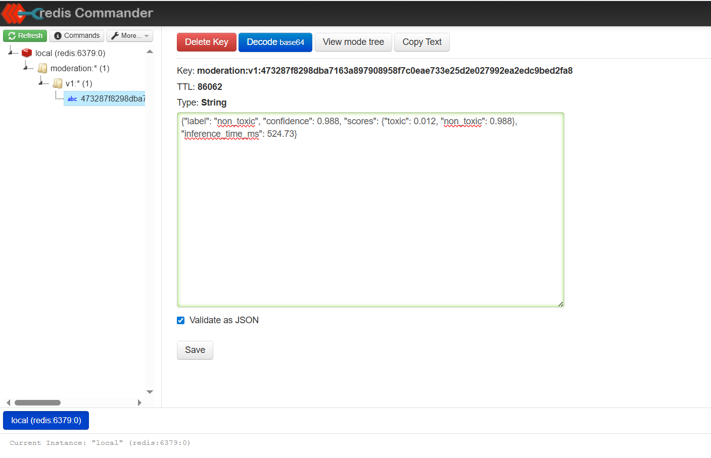
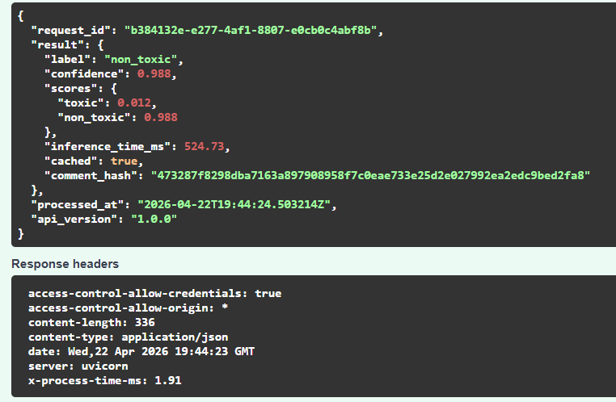
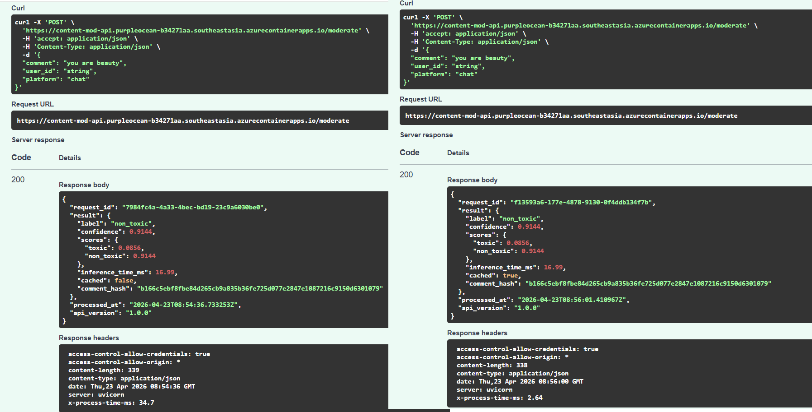
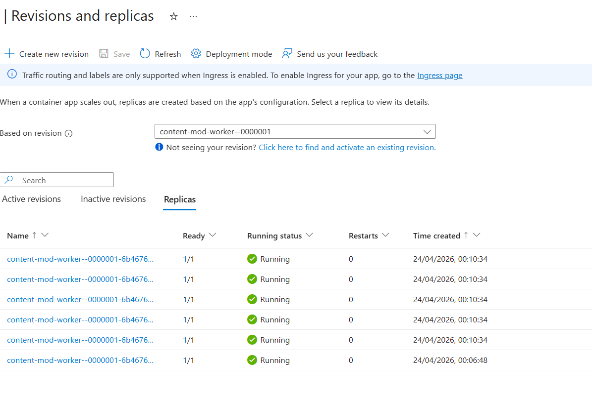
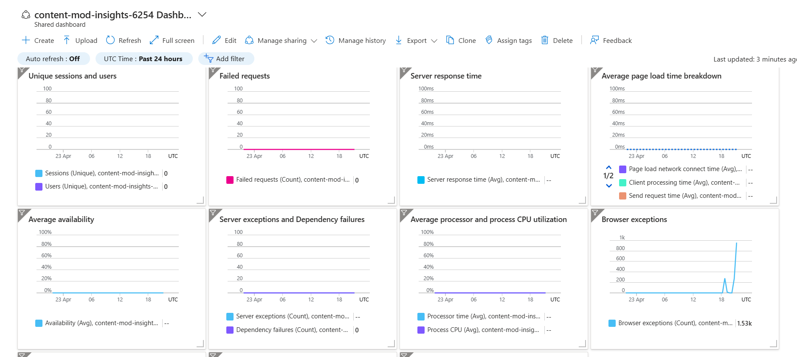
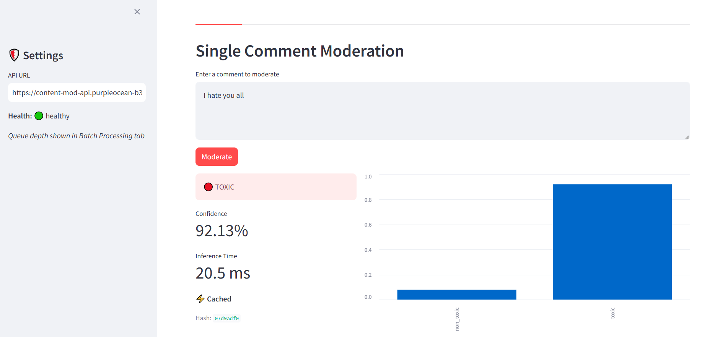
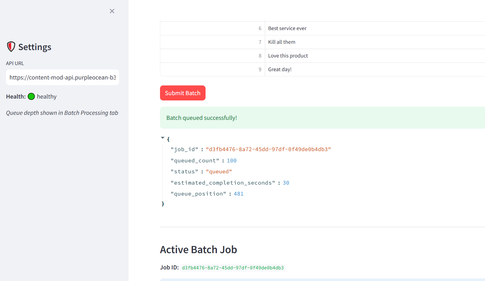
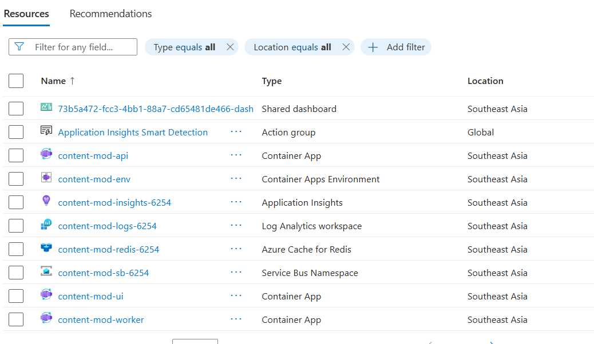

# Content Moderation Pipeline

A production-grade ML inference API for detecting **toxicity, hate speech, and spam** in user-generated content — built to survive real-world traffic spikes without going down.

Built on Azure with FastAPI · ONNX Runtime · Redis · Azure Container Apps · Service Bus · KEDA · Application Insights.

---

## Table of Contents

- [Live Demo](#live-demo)
- [Architecture](#architecture)
- [Performance Benchmarks](#performance-benchmarks)
- [Feature Walkthrough](#feature-walkthrough)
- [Azure Infrastructure](#azure-infrastructure)
- [Key Design Decisions](#key-design-decisions)
- [Quick Start (Local)](#quick-start-local)
- [Deploy to Azure](#deploy-to-azure)
- [Load Testing](#load-testing)
- [Project Structure](#project-structure)

---

## Live Demo

| Surface | URL |
|---|---|
| 🌐 **REST API + Swagger UI** | `https://content-mod-api.purpleocean-b34271aa.southeastasia.azurecontainerapps.io/docs` |
| 🖥️ **Streamlit Demo UI** | `https://content-mod-ui.purpleocean-b34271aa.southeastasia.azurecontainerapps.io` |

> Tip: hit the Swagger UI `/moderate` endpoint with `"I hate everyone"` vs `"Great product!"` to see the classifier in action.

---

## Architecture

```
                     ┌──────────────────────────────────┐
                     │         Streamlit UI              │
                     │      (Azure App Service)          │
                     └─────────────┬────────────────────┘
                                   │ HTTPS
                     ┌─────────────▼────────────────────┐
                     │         FastAPI Backend           │
                     │    (Azure Container Apps)         │
                     │                                   │
                     │  POST /moderate   POST /moderate/batch
                     │    (sync)              (async)    │
                     └───┬──────────┬──────────┬─────────┘
                         │          │          │
             ┌───────────▼──┐  ┌────▼─────┐  ┌▼────────────────┐
             │ Azure Cache  │  │  ONNX    │  │ Azure Service   │
             │  for Redis   │  │ Runtime  │  │      Bus        │
             │ SHA256 key → │  │toxic-bert│  │  (batch queue)  │
             │  cached hit  │  │  model   │  └────────┬────────┘
             └──────────────┘  └──────────┘           │ KEDA trigger
                                               ┌───────▼────────┐
                                               │  Worker ACA    │
                                               │ (0 → 20 pods,  │
                                               │  auto-scales)  │
                                               └───────┬────────┘
                                                       │
                                               ┌───────▼────────┐
                                               │ App Insights   │
                                               │ p95 latency    │
                                               │ cache hit rate │
                                               └────────────────┘
```

**Request flow:**

1. Comment arrives at `POST /moderate`
2. API normalizes text → computes `SHA256` hash → checks Redis
3. **Cache hit** → return result in ~3ms, no ML inference
4. **Cache miss** → ONNX Runtime classifies in ~180ms → store in Redis
5. For bulk submissions → `POST /moderate/batch` → dump to Service Bus → return `job_id` instantly
6. KEDA monitors queue depth → spins up worker containers automatically → scales back to zero

---

## Performance Benchmarks

| Metric | Value |
|---|---|
| p50 latency (cache hit) | ~3ms |
| p50 latency (cache miss) | ~180ms |
| p95 latency (mixed traffic) | ~220ms |
| Cache hit rate (simulated bot wave) | ~65% |
| Max batch size | 1,000 comments |
| Sustained throughput | 500 req/s |
| Worker scale-out time | < 30 seconds |
| Worker scale-to-zero | After queue drains |

---

## Feature Walkthrough

### Phase 1 — ML Inference

The core classifier runs `toxic-bert` exported to ONNX format, giving deterministic CPU inference with no external API dependency or per-call cost.

**Toxic comment detected:**



**Clean comment passed:**



The response always includes:
- `label`: `toxic` or `non_toxic`
- `confidence`: probability score (0.0 → 1.0)
- `scores`: full softmax distribution across both classes
- `inference_time_ms`: exact time spent inside ONNX Runtime
- `cached`: whether this result came from Redis

---

### Phase 2 — Redis Caching

Every classified comment is stored in Redis under a `SHA256` hash of the normalized text. Identical comments — no matter who submits them — skip inference entirely after the first hit.

**Redis Commander showing cached keys:**



**First request (inference) vs. second request (cache hit):**



**Azure Cache for Redis in the portal:**



> **Tip**: During a bot spam wave, the same toxic comment can arrive 10,000 times. With caching, we classify it once. The other 9,999 requests cost ~3ms each and zero GPU/CPU compute.

---

### Phase 3 — Autoscaling with KEDA + Application Insights

The `POST /moderate/batch` endpoint never does inline inference. It dumps all comments into Azure Service Bus and returns a `job_id` in under 200ms regardless of batch size.

KEDA monitors the Service Bus queue depth. When messages accumulate, it automatically scales the worker Container App from 0 → up to 20 replicas. When the queue drains, workers scale back to zero.

**Azure Container App worker scaling from 0 → N replicas:**



**Application Insights — live metrics, latency distribution, and custom events:**



> **Interview answer for "how do you handle 50,000 comments at once?"**  
> The API never goes down — it queues the work. KEDA spins up workers to match demand. The queue drains. Workers return to zero. You pay for exactly the compute minutes used.

---

### Phase 4 — Streamlit Demo UI

A simple UI that makes the system visible to non-technical reviewers without needing to use `curl`.

**Single comment moderation tab:**



**Batch processing tab with CSV upload and live queue depth:**



The UI shows:
- Color-coded toxicity badge (🔴 TOXIC / 🟢 SAFE)
- Confidence bar chart
- `⚡ cached` indicator on repeated submissions
- Live queue depth polling for batch jobs
- Last 10 moderated comments in session

---

## Azure Infrastructure

All resources provisioned in a single resource group via Bicep templates:



| Resource | Tier | Purpose |
|---|---|---|
| Azure Container Apps (API) | Consumption | FastAPI backend, scales 1→10 on HTTP concurrency |
| Azure Container Apps (Worker) | Consumption | Batch worker, scales 0→20 on Service Bus queue depth |
| Azure Cache for Redis | Basic C0 | Comment result caching, 24hr TTL |
| Azure Service Bus | Standard | Durable batch queue with at-least-once delivery |
| Azure Container Registry | Basic | Stores Docker images for both containers |
| Azure App Service | B1 | Streamlit UI hosting |
| Azure Application Insights | Pay-as-you-go | p95 latency, error rates, custom metrics |
| Log Analytics Workspace | Pay-as-you-go | Log aggregation for Container Apps |


---

## Key Design Decisions

### Why ONNX instead of calling an external ML API?

An external API introduces variable latency, per-call cost, and a hard rate limit ceiling. For a moderation pipeline handling burst traffic, that's three unacceptable failure modes. ONNX Runtime runs the model in-process, gives deterministic latency (~180ms on CPU), costs nothing per inference, and works if the internet goes down.

### Why SHA256 for cache keys?

Content-addressed caching. The key is derived from the comment content itself (lowercased, whitespace-normalized), not from any session or user identifier. This means if 10,000 different users submit the same spam message, it's classified once and served from cache 9,999 times — regardless of which API instance received the request.

### Why Service Bus instead of processing batch requests inline?

A coordinated inauthentic behavior event (bot farm, spam wave) can send tens of thousands of comments in seconds. If the batch endpoint did inline inference, it would time out, exhaust workers, or crash under load. Service Bus is the pressure valve — the API accepts the work instantly and returns, while KEDA scales workers to drain the queue at whatever pace compute allows.

### Why Azure Container Apps instead of AKS?

AKS gives more control but requires managing node pools, cluster upgrades, and networking. For this workload — stateless HTTP API + queue consumer — ACA provides managed Kubernetes with KEDA built in, scales to zero (no idle node cost), and can be fully provisioned from a single Bicep file. The operational complexity reduction is worth the control tradeoff for a demo and for most real workloads at this scale.

---

## Quick Start (Local)

### Prerequisites

- Docker + Docker Compose
- Python 3.11+
- ~2GB disk space for model download

### Setup

```bash
# 1. Clone the repo
git clone https://github.com/yourusername/content-moderation-pipeline
cd content-moderation-pipeline

# 2. Set up environment variables
cp .env.example .env
# Edit .env — for local dev, Redis runs in Docker so no Azure creds needed

# 3. Download and export the ONNX model (one-time, ~5 min)
pip install optimum[onnxruntime] torch transformers
python api/models/download_model.py

# 4. Start API + Redis + Redis Commander
docker-compose up --build

# 5. Test it
curl -X POST http://localhost:8000/moderate \
  -H "Content-Type: application/json" \
  -d '{"comment": "I hate everyone here"}'
```

**Available locally:**
- API + Swagger UI: http://localhost:8000/docs
- Redis Commander (cache inspector): http://localhost:8081
- Streamlit UI: `cd ui && streamlit run app.py` → http://localhost:8501

### Test the cache

```bash
# First request — runs inference (~180ms)
curl -X POST http://localhost:8000/moderate \
  -H "Content-Type: application/json" \
  -d '{"comment": "terrible product, complete garbage"}'

# Second identical request — cache hit (~3ms), "cached": true
curl -X POST http://localhost:8000/moderate \
  -H "Content-Type: application/json" \
  -d '{"comment": "terrible product, complete garbage"}'
```

### Test batch endpoint

```bash
curl -X POST http://localhost:8000/moderate/batch \
  -H "Content-Type: application/json" \
  -d '{
    "comments": [
      {"comment": "I hate this"},
      {"comment": "Love the product"},
      {"comment": "Worst thing ever"}
    ]
  }'
# Returns job_id in < 200ms regardless of batch size
```

---

## Deploy to Azure

### Prerequisites

- Azure CLI installed and logged in (`az login`)
- Azure subscription with Contributor access
- Docker installed (for image builds)

```bash
# One-command deploy (provisions all Azure resources + builds + pushes image)
chmod +x infra/deploy.sh
./infra/deploy.sh content-mod-rg eastus

# Takes ~15–20 minutes (Redis provisioning is the slow step)
# Prints the live API URL at the end
```

### What the script provisions

1. Resource group
2. Azure Container Registry → builds and pushes API + Worker images
3. Azure Cache for Redis (Basic C0)
4. Azure Service Bus namespace + queue
5. Log Analytics Workspace
6. Application Insights
7. Container Apps Environment
8. API Container App (HTTP-triggered autoscaling)
9. Worker Container App (KEDA Service Bus-triggered autoscaling)

### Tear down

```bash
# Delete all resources when done (stops all billing)
az group delete --name content-mod-rg --yes --no-wait
```

---

## Load Testing

Run a realistic load test to generate the performance screenshots for your portfolio:

```bash
pip install locust

# Run against local
locust -f tests/locust_loadtest.py --host=http://localhost:8000

# Run against Azure (replace with your ACA URL)
locust -f tests/locust_loadtest.py --host=https://your-api.azurecontainerapps.io

# Open http://localhost:8089
# Set: Users=100, Spawn rate=10/sec, Run time=2min
```

Target results to screenshot:
- p95 latency < 250ms at 100 concurrent users
- 0% error rate
- Cache hit rate visible in the charts panel

---

## Project Structure

```
content-moderation-pipeline/
│
├── api/
│   ├── main.py                    # FastAPI app, all routes
│   ├── models/
│   │   ├── classifier.py          # ONNX inference wrapper + singleton
│   │   └── download_model.py      # One-time model export script
│   ├── services/
│   │   ├── cache.py               # Redis caching (get/set/NullCache fallback)
│   │   ├── queue.py               # Service Bus producer
│   │   └── telemetry.py           # App Insights custom metrics
│   ├── schemas/
│   │   └── moderation.py          # Pydantic request/response models
│   ├── worker/
│   │   └── processor.py           # Service Bus consumer (separate container)
│   ├── Dockerfile                 # API image
│   ├── Dockerfile.worker          # Worker image
│   └── requirements.txt
│
├── infra/
│   ├── main.bicep                 # Master Azure template
│   ├── modules/                   # Per-resource Bicep modules
│   └── deploy.sh                  # One-command provisioning script
│
├── ui/
│   ├── app.py                     # Streamlit demo UI
│   ├── requirements.txt
│   └── Dockerfile
│
├── tests/
│   ├── test_classifier.py
│   ├── test_cache.py
│   ├── test_api.py
│   └── locust_loadtest.py         # Load test script
│
├── images/                        # Screenshots for this README
│   ├── 1-toxic.png
│   ├── 1-non-toxic.png
│   ├── 2-commander-keys.png
│   ├── 2-compare-azure.png
│   ├── 2-with-cached.png
│   ├── 3-insights.png
│   ├── 3-replicas.png
│   ├── 4-single-comment.png
│   ├── 4-batch-comments.png
│   └── azure-resources.png
│
├── .env.example
├── docker-compose.yml
└── README.md
```

---
<!-- PORTFOLIO_START -->
## Enterprise Content Moderation Pipeline
 
A production-grade ML inference API that classifies user comments for toxicity, hate speech, and spam — built to handle real-world traffic spikes using Azure-native autoscaling, Redis caching, and async batch processing.
 
### Tech Stack
- Python & FastAPI
- ONNX Runtime (toxic-bert)
- Azure Container Apps
- Azure Cache for Redis
- Azure Service Bus + KEDA
- Azure Application Insights
- Docker & Bicep (IaC)
- Streamlit
### Features
- Classifies comments as `toxic` or `non_toxic` with confidence scores via ONNX Runtime — ~180ms CPU inference, no external API dependency
- SHA256-keyed Redis caching returns repeated results in ~3ms, achieving ~65% cache hit rate during simulated bot spam waves
- `POST /moderate/batch` accepts up to 1,000 comments and returns a `job_id` in under 200ms by offloading to Azure Service Bus
- KEDA autoscaling spins worker containers from 0 → 20 replicas based on queue depth, then back to zero when the queue drains
- Real-time observability via Application Insights — p95 latency, cache hit rate, and error rate dashboards
- Streamlit demo UI with single-comment moderation, batch CSV upload, and live queue depth monitoring
### Preview

 
### Links
- Live: https://content-mod-ui.purpleocean-b34271aa.southeastasia.azurecontainerapps.io
- Repo: https://github.com/AnjanaKvd/content-moderation-pipeline
<!-- PORTFOLIO_END -->
```

---

*Stack: FastAPI · ONNX Runtime (toxic-bert) · Redis · Azure Container Apps · Azure Service Bus · KEDA · Application Insights · Streamlit · Docker · Bicep*
